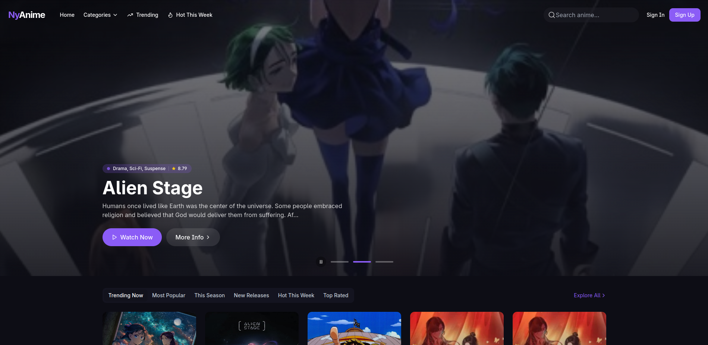

<div align="center">



# ✦ NyAnime

<samp>ネコアニメ — Your Cozy Corner for Anime Streaming</samp>

<br/>

[](https://github.com/AnjishnuSengupta/nyanime/releases)
[](https://nyanime.tech)
[](LICENSE)
[](https://github.com/AnjishnuSengupta/nyanime/stargazers)
[](https://www.instagram.com/anjishnu.prolly)

<br/>

<kbd>[🌐 **Live Demo**](https://nyanime.tech)</kbd>&nbsp;&nbsp;
<kbd>[🖥️ **Terminal Client**](https://github.com/AnjishnuSengupta/ny-cli)</kbd>&nbsp;&nbsp;
<kbd>[🐛 **Report Bug**](https://github.com/AnjishnuSengupta/nyanime/issues)</kbd>

<br/>

</div>

---

<br/>

## 🎯 What's New in v2.2.0

<table>
<tr>
<td>🎬</td>
<td><b>Skip Intro & Outro</b></td>
<td>One-click skip buttons automatically appear during intro/outro segments using API timestamps</td>
</tr>
<tr>
<td>📝</td>
<td><b>Smart Subtitles</b></td>
<td>English subtitles auto-selected by default with easy language switching overlay</td>
</tr>
<tr>
<td>⚡</td>
<td><b>Backend Wake-up</b></td>
<td>Automatic backend ping on app load to minimize cold start delays on free-tier hosting</td>
</tr>
<tr>
<td>🔧</td>
<td><b>Express 5 Support</b></td>
<td>Full compatibility with Express 5.x and latest dependency updates</td>
</tr>
<tr>
<td>🦊</td>
<td><b>Cross-Browser Fix</b></td>
<td>Resolved video playback loop issues in Chromium-based browsers</td>
</tr>
</table>

<br/>

---

<br/>

## ✨ Features

<div align="center">

```
╭─────────────────────────────────────────────────────────────────╮
│                                                                 │
│   🎬  STREAMING          👤  EXPERIENCE        🔧  TECHNICAL    │
│   ───────────────        ───────────────       ───────────────  │
│                                                                 │
│   ▸ HLS Adaptive         ▸ User Accounts       ▸ React 18 + TS  │
│   ▸ Multi-Server         ▸ Watch History       ▸ Vite 7 Build   │
│   ▸ Sub/Dub Toggle       ▸ Favorites List      ▸ Express 5 API  │
│   ▸ Skip Intro/Outro     ▸ Cross-Device        ▸ HLS.js Player  │
│   ▸ Auto Subtitles       ▸ Custom Avatars      ▸ Firebase Auth  │
│   ▸ Resume Playback      ▸ Dark/Light Mode     ▸ Tailwind CSS   │
│                                                                 │
╰─────────────────────────────────────────────────────────────────╯
```

</div>

<br/>

<details>
<summary><b>📺 Video Player Highlights</b></summary>

<br/>

| Feature | Description |
|:--------|:------------|
| **🔄 Adaptive Streaming** | HLS with automatic quality switching based on network conditions |
| **⏭️ Skip Intro/Outro** | Smart buttons appear during intro (0-90s) and outro segments |
| **📝 Smart Subtitles** | Auto-selects English, with dropdown for 10+ languages |
| **🔁 Auto-Retry** | Automatic server fallback and error recovery |
| **📍 Resume Playback** | Continue from exactly where you left off |
| **🎚️ Source Selector** | Switch between multiple streaming servers |

</details>

<details>
<summary><b>👤 User Features</b></summary>

<br/>

| Feature | Description |
|:--------|:------------|
| **🔐 Secure Auth** | Firebase authentication with email/password |
| **📜 Watch History** | Track all watched episodes with timestamps |
| **❤️ Favorites** | Save your favorite anime for quick access |
| **☁️ Cloud Sync** | Seamless sync across all your devices |
| **🎨 Customization** | Choose from 50+ anime character avatars |
| **🌓 Themes** | Beautiful dark and light mode support |

</details>

<br/>

---

<br/>

## 🖥️ NY-CLI — Watch from Your Terminal

<div align="center">

```
╔══════════════════════════════════════════╗
║                                          ║
║   $ ny-cli search "one piece"            ║
║                                          ║
║   Searching...                           ║
║   Found: One Piece (1120 eps)            ║
║   Playing episode 1120...                ║
║                                          ║
╚══════════════════════════════════════════╝
```

[](https://github.com/AnjishnuSengupta/ny-cli)

</div>

Love the command line? **NY-CLI** brings the full NyAnime experience to your terminal!

```bash
# One-line install
curl -sL https://raw.githubusercontent.com/AnjishnuSengupta/ny-cli/main/install.sh | sh

# Or via npm
npm install -g ny-cli
```

<div align="center">

**Features:** `Search` · `Trending` · `Continue Watching` · `Cloud Sync` · `MPV/VLC Support`

👉 [**Get NY-CLI →**](https://github.com/AnjishnuSengupta/ny-cli)

</div>

<br/>

---

<br/>

## 🚀 Quick Start

<br/>

### Prerequisites

- **Node.js** 18+ 
- **npm** or **yarn**
- **Firebase** project (for auth & database)

<br/>

### Installation

```bash
# Clone the repository
git clone https://github.com/AnjishnuSengupta/nyanime.git

# Navigate to project
cd nyanime

# Install dependencies
npm install

# Copy environment template
cp .env.example .env

# Start development server
npm run dev
```

<br/>

### Environment Setup

Create a `.env` file with your Firebase credentials:

```env
VITE_FIREBASE_API_KEY=your_api_key
VITE_FIREBASE_AUTH_DOMAIN=your_project.firebaseapp.com
VITE_FIREBASE_PROJECT_ID=your_project_id
VITE_FIREBASE_STORAGE_BUCKET=your_project.appspot.com
VITE_FIREBASE_MESSAGING_SENDER_ID=your_sender_id
VITE_FIREBASE_APP_ID=your_app_id
```

<br/>

Open **[localhost:8080](http://localhost:8080)** and start watching! 🎉

<br/>

---

<br/>

## 🛠️ Tech Stack

<br/>

<div align="center">

| Layer | Technologies |
|:-----:|:-------------|
| **Frontend** |     |
| **Backend** |   |
| **Services** |   |
| **APIs** |   |

</div>

<br/>

---

<br/>

## 📦 Deployment

<br/>

### Render (Recommended)

<table>
<tr>
<td><b>Build Command</b></td>
<td><code>npm install && npm run build</code></td>
</tr>
<tr>
<td><b>Start Command</b></td>
<td><code>npm start</code></td>
</tr>
<tr>
<td><b>Health Check</b></td>
<td><code>/health</code></td>
</tr>
</table>

> **Note:** Free tier has ~50s cold start. The app automatically pings the backend on load to minimize delays.

<br/>

### Vercel / Netlify

Works out of the box for static frontend deployment. Configure redirects for SPA routing.

<br/>

---

<br/>

## 📁 Project Structure

```
nyanime/
├── 📂 src/
│   ├── 📂 components/     # React components
│   │   ├── VideoPlayer    # HLS player with skip buttons
│   │   ├── AnimePlayer    # Episode management
│   │   └── ui/            # shadcn/ui components
│   ├── 📂 pages/          # Route pages
│   ├── 📂 services/       # API services
│   ├── 📂 hooks/          # Custom React hooks
│   └── 📂 config/         # Firebase & API config
├── 📂 api/                # Serverless functions
├── 📂 public/             # Static assets
├── 📄 server.js           # Express server
└── 📄 vite.config.ts      # Vite configuration
```

<br/>

---

<br/>

## 🤝 Contributing

<br/>

Contributions are welcome! Here's how you can help:

```bash
# 1. Fork the repository

# 2. Create your feature branch
git checkout -b feature/amazing-feature

# 3. Commit your changes
git commit -m "feat: add amazing feature"

# 4. Push to the branch
git push origin feature/amazing-feature

# 5. Open a Pull Request
```

<br/>

---

<br/>

## 🔗 Links & Resources

<br/>

<div align="center">

| | |
|:-:|:-:|
| 🌐 **Website** | [nyanime.tech](https://nyanime.tech) |
| 🖥️ **Terminal Client** | [NY-CLI](https://github.com/AnjishnuSengupta/ny-cli) |
| 📚 **Aniwatch API** | [ghoshRitesh12/aniwatch-api](https://github.com/ghoshRitesh12/aniwatch-api) |
| 📊 **Jikan API** | [jikan.moe](https://jikan.moe) |

</div>

<br/>

---

<br/>

## 📜 License

<br/>

<div align="center">

This project is licensed under the **MIT License**.

Use freely. Give credit. Build cool things. 💜

</div>

<br/>

---

<br/>

<div align="center">

### ⚠️ Disclaimer

<samp>
This is an educational project. No video content is hosted on our servers.<br/>
All streams are fetched from third-party sources. Use responsibly.
</samp>

<br/>
<br/>

---

<br/>


<br/>

<samp>

*"In a world full of filler episodes, be the main arc."* ✦

</samp>

<br/>

**Made with 💜 by [Anjishnu](https://github.com/AnjishnuSengupta)**

[](https://www.instagram.com/anjishnu.prolly)

<br/>

⭐ Star this repo if you found it useful!

</div>
