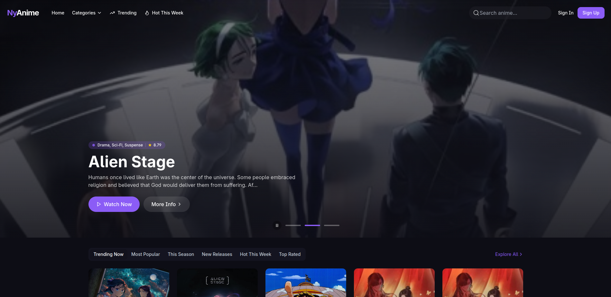

<div align="center">



# ✦ NyAnime

<samp>ネコアニメ — Your Cozy Corner for Anime Streaming</samp>

<br/>

[](https://github.com/AnjishnuSengupta/nyanime/releases)
[](https://nyanime.qzz.io)
[](LICENSE)
[](https://github.com/AnjishnuSengupta/nyanime/stargazers)
[](https://www.instagram.com/anjishnu.prolly)

<br/>

<kbd>[🌐 **Live Demo**](https://nyanime.qzz.io)</kbd>&nbsp;&nbsp;
<kbd>[🖥️ **Terminal Client**](https://github.com/AnjishnuSengupta/ny-cli)</kbd>&nbsp;&nbsp;
<kbd>[🐛 **Report Bug**](https://github.com/AnjishnuSengupta/nyanime/issues)</kbd>

<br/>

</div>

---

<br/>

## 🎯 What's New in v2.5.3

<table>
<tr>
<td>🔍</td>
<td><b>Jikan API Integration</b></td>
<td>Uses Jikan API (official MyAnimeList API, 99.9% uptime) for reliable metadata provider. Fallback to AnimeKAI for missing data.</td>
</tr>
<tr>
<td>⚡</td>
<td><b>AnimeKAI Streaming Fix</b></td>
<td>Fixed production streaming by using AnimeKAI bridge. Jikan (metadata) → AnimeKAI (streaming sources). Resolves 404 errors on Render.</td>
</tr>
<tr>
<td>📊</td>
<td><b>Accurate Episode Tracking</b></td>
<td>Displays all available episodes correctly. Episode ID format: jikan::malId::episodeNumber for proper routing and fallback.</td>
</tr>
<tr>
<td>🌐</td>
<td><b>Production-Ready Streaming</b></td>
<td>Fully tested on Render production. Metadata search from Jikan, streaming sources from AnimeKAI, M3U8 playback via HLS.</td>
</tr>
</table>
<td><b>Domain Migration</b></td>
<td>Fully migrated to www.nyanime.qzz.io with canonical URL enforcement and PWA support</td>
</tr>
</table>

<br/>

### Previous Updates (v2.4.0)

<details>
<summary>Click to expand v2.4.0 changelog</summary>

<br/>

<table>
<tr>
<td>🎥</td>
<td><b>HLS.js Streaming</b></td>
<td>Native HLS.js player with adaptive quality, replacing iframe embeds</td>
</tr>
<tr>
<td>🧭</td>
<td><b>Season-Safe Matching</b></td>
<td>Explicit season-aware ranking prevents season overlap (e.g., S3 titles resolving to S1 sources)</td>
</tr>
<tr>
<td>🛡️</td>
<td><b>CDN Resilience</b></td>
<td>Delayed retry with backoff, referer rotation, and source re-fetch for MegaCloud CDN blocking</td>
</tr>
<tr>
<td>⚡</td>
<td><b>Rapid Episode Switch</b></td>
<td>Three-layer request cancellation (AbortController + signal forwarding + server disconnect detection)</td>
</tr>
<tr>
<td>🎬</td>
<td><b>Skip Intro & Outro</b></td>
<td>One-click skip buttons using API-provided timestamps</td>
</tr>
</table>

</details>

<br/>

---

<br/>

## ✨ Features

<div align="center">

```
╭─────────────────────────────────────────────────────────────────╮
│                                                                 │
│   🎬  STREAMING          👤  EXPERIENCE        🔧  TECHNICAL    │
│   ───────────────        ───────────────       ───────────────  │
│                                                                 │
│   ▸ HLS Adaptive         ▸ User Accounts       ▸ React 18 + TS  │
│   ▸ Multi-Server         ▸ Watch History       ▸ Vite 7 Build   │
│   ▸ Sub/Dub Toggle       ▸ Favorites List      ▸ Express 5 API  │
│   ▸ Skip Intro/Outro     ▸ Cross-Device        ▸ HLS.js Player  │
│   ▸ Auto Subtitles       ▸ Custom Avatars      ▸ Self-Hosted    │
│   ▸ Resume Playback      ▸ Dark/Light Mode     ▸ Tailwind CSS   │
│                                                                 │
╰─────────────────────────────────────────────────────────────────╯
```

</div>

<br/>

<details>
<summary><b>📺 Video Player Highlights</b></summary>

<br/>

| Feature | Description |
|:--------|:------------|
| **🔄 Adaptive Streaming** | HLS.js with automatic quality switching and same-origin stream proxy |
| **⏭️ Skip Intro/Outro** | Smart buttons appear during intro and outro segments |
| **⏪⏩ Quick Seek** | Instant ±10 second skip buttons for precise playback control |
| **📝 Smart Subtitles** | Auto-selects English, with dropdown for 10+ languages |
| **🔁 Auto-Retry** | Multi-phase error recovery: delayed retry, source re-fetch, embed fallback |
| **📍 Resume Playback** | Continue from exactly where you left off with smart episode progression |
| **🎚️ Source Selector** | Switch between multiple streaming servers on-the-fly |
| **🎯 Smart Progress** | Auto-cleanup completed series and intelligent next episode detection |

</details>

<details>
<summary><b>👤 User Experience Features</b></summary>

<br/>

| Feature | Description |
|:--------|:------------|
| **🔐 Secure Auth** | Firebase authentication with email/password and Google OAuth |
| **📜 Smart History** | Auto-tracking with intelligent duplicate prevention |
| **🔄 Auto-Progress** | Automatically advance to next episode on 97%+ completion |
| **🗑️ Auto-Cleanup** | Completed series removed automatically from Continue Watching |
| **❤️ Favorites** | Save your favorite anime for instant access |
| **☁️ Cloud Sync** | Seamless sync across all your devices in real-time |
| **🎨 Customization** | Choose from 50+ anime character avatars |
| **🌓 Themes** | Beautiful dark and light mode with smooth transitions |
| **📅 Seasonal Updates** | Automatic refresh when anime seasons change |

</details>

<br/>

---

<br/>

## 🖥️ NY-CLI — Watch from Your Terminal

<div align="center">

```
╔══════════════════════════════════════════╗
║                                          ║
║   $ ny-cli search "one piece"            ║
║                                          ║
║   Searching...                           ║
║   Found: One Piece (1120 eps)            ║
║   Playing episode 1120...                ║
║                                          ║
╚══════════════════════════════════════════╝
```

[](https://github.com/AnjishnuSengupta/ny-cli)

</div>

Love the command line? **NY-CLI** brings the full NyAnime experience to your terminal!

```bash
# One-line install
curl -sL https://raw.githubusercontent.com/AnjishnuSengupta/ny-cli/main/install.sh | sh

# Or via npm
npm install -g ny-cli
```

<div align="center">

**Features:** `Search` · `Trending` · `Continue Watching` · `Cloud Sync` · `MPV/VLC Support`

👉 [**Get NY-CLI →**](https://github.com/AnjishnuSengupta/ny-cli)

</div>

<br/>

---

<br/>

## 🚀 Quick Start

<br/>

### Prerequisites

- **Node.js** 18+ 
- **npm** or **yarn**
- **Firebase** project (for auth & database)

<br/>

### Installation

```bash
# Clone the repository
git clone https://github.com/AnjishnuSengupta/nyanime.git

# Navigate to project
cd nyanime

# Install dependencies
npm install

# Copy environment template
cp .env.example .env

# Start development server
npm run dev
```

<br/>

### Environment Setup

Create a `.env` file with your Firebase credentials:

```env
VITE_FIREBASE_API_KEY=your_api_key
VITE_FIREBASE_AUTH_DOMAIN=your_project.firebaseapp.com
VITE_FIREBASE_PROJECT_ID=your_project_id
VITE_FIREBASE_STORAGE_BUCKET=your_project.appspot.com
VITE_FIREBASE_MESSAGING_SENDER_ID=your_sender_id
VITE_FIREBASE_APP_ID=your_app_id
```

<br/>

Open **[localhost:8080](http://localhost:8080)** and start watching! 🎉

<br/>

---

<br/>

## 🛠️ Tech Stack

<br/>

<div align="center">

| Layer | Technologies |
|:-----:|:-------------|
| **Frontend** |     |
| **Backend** |   |
| **Services** |   |
| **Scraping** |  |

</div>

<br/>

---

<br/>

## 🎬 Streaming Architecture

NyAnime uses a **multi-provider strategy** for maximum reliability:

### Provider Chain (in order)
1. **Jikan API** (Primary — Metadata)
   - Official MyAnimeList API, no scraping required
   - Used for: Search, anime info, episode lists, episode titles
   - **Reliable:** 99.9% uptime, no rate limiting for metadata
   - Returns all episodes with accurate numbering

2. **AnimeKAI** (Streaming Sources)
   - Primary source for M3U8 streaming URLs
   - Used for: Finding episode tokens, extracting streaming links
   - Direct integration for high streaming success rate

### Request Flow
```
User searches anime
    ↓
Try Jikan API → AnimeKAI
    ↓ (if found, continues with this anime)
User clicks episode
    ↓
Get episode info from Jikan (title, number)
    ↓
Search anime on AnimeKAI (by title)
    ↓
Get episode token from AnimeKAI
    ↓
Fetch M3U8 streaming sources from AnimeKAI
    ↓
HLS.js player streams with adaptive quality
```

### Why This Architecture?
- **Jikan:** Stable official API, no scraping, no downtime
- **AnimeKAI:** Backup metadata provider for edge cases
- **Fallbacks:** If one provider down, others automatically used

### No Custom Backend Needed
- All APIs are public (Jikan, AnimeKAI)
- No authentication or API keys required
- Pure proxy model — Express.js delegates to providers
- Lightweight, deployable on free tier (Render, Vercel)

<br/>

---

<br/>

## 📦 Deployment

<br/>

### Render (Recommended)

<table>
<tr>
<td><b>Build Command</b></td>
<td><code>npm install && npm run build</code></td>
</tr>
<tr>
<td><b>Start Command</b></td>
<td><code>npm start</code></td>
</tr>
<tr>
<td><b>Health Check</b></td>
<td><code>/health</code></td>
</tr>
</table>

> **Note:** Free tier has ~50s cold start. The app automatically pings the backend on load to minimize delays.

#### Required Env Vars (Render Web Service)

- `NODE_ENV=production`
- `VITE_USE_DIRECT_API=false`

**Note:** No additional API URLs needed. All providers are public and hardcoded.

### Vercel

Vercel is supported via `/api/*` serverless routes in this repo.

#### Required Env Vars (Vercel Project)

- `NODE_ENV=production`
- `RENDER_STREAM_PROXY=https://<your-render-service-domain>`
- `VITE_STREAM_PROXY_URL=https://<your-render-service-domain>`

### Do I need to host any external anime API backend?

**No.** As of v2.5.3, NyAnime uses fully public APIs:
- **Jikan API** (primary metadata provider — official MyAnimeList API)
- **AnimeKAI** (primary streaming sources provider)
- **Consumet:** No longer used as a fallback metadata aggregator

All are publicly accessible with no authentication required. No custom backend needed. No API keys required.

### Free-tier spin down notes

- Render free instances can sleep.
- NyAnime is now implemented to work seamlessly with AnimeKAI:
    - AnimeKAI has no rate limits or auth restrictions for public API
    - Requests fail fast if AnimeKAI is unavailable (no long timeouts)
    - Recommended: Use Render paid tier for stable streaming

### Production Checklist

- ✅ Use HTTPS for all API calls and frontend (handled by Render/Vercel)
- ✅ Deploy on **Render Web Service** or **Vercel** (not static site)
- ✅ Set `NODE_ENV=production` and `VITE_USE_DIRECT_API=false`
- ✅ No external backend needed — all APIs public
- ✅ Jikan API provides primary metadata (search, info, episodes)
- ✅ AnimeKAI provides streaming sources (M3U8 URLs)
- ✅ On Vercel: Set `RENDER_STREAM_PROXY` to your Render service URL (for CDN relay)

<br/>

<br/>

---

<br/>

## 📁 Project Structure

```
nyanime/
├── 📂 src/
│   ├── 📂 components/     # React components
│   │   ├── VideoPlayer    # HLS player with skip buttons
│   │   ├── AnimePlayer    # Episode management
│   │   └── ui/            # shadcn/ui components
│   ├── 📂 pages/          # Route pages
│   ├── 📂 services/       # API services
│   ├── 📂 hooks/          # Custom React hooks
│   └── 📂 config/         # Firebase & API config
├── 📂 api/                # Serverless functions
├── 📂 public/             # Static assets
├── 📄 server.js           # Express server
└── 📄 vite.config.ts      # Vite configuration
```

<br/>

---

<br/>

## 🤝 Contributing

<br/>

Contributions are welcome! Here's how you can help:

```bash
# 1. Fork the repository

# 2. Create your feature branch
git checkout -b feature/amazing-feature

# 3. Commit your changes
git commit -m "feat: add amazing feature"

# 4. Push to the branch
git push origin feature/amazing-feature

# 5. Open a Pull Request
```

<br/>

---

<br/>

## 🔗 Links & Resources

<br/>

<div align="center">

| | |
|:-:|:-:|
| 🌐 **Website** | [nyanime.qzz.io](https://nyanime.qzz.io) |
| 🖥️ **Terminal Client** | [NY-CLI](https://github.com/AnjishnuSengupta/ny-cli) |
| 🎬 **Allanime Reference (ani-cli)** | [pystardust/ani-cli](https://github.com/pystardust/ani-cli) |
| 🏗️ **Architecture** | [ARCHITECTURE.md](ARCHITECTURE.md) |

</div>

<br/>

---

<br/>

## ⭐ Star History

<br/>

<div align="center">

<a href="https://www.star-history.com/?repos=AnjishnuSengupta%2Fnyanime&type=date&legend=top-left">
 <picture>
   <source media="(prefers-color-scheme: dark)" srcset="https://api.star-history.com/chart?repos=AnjishnuSengupta/nyanime&type=date&theme=dark&legend=top-left" />
   <source media="(prefers-color-scheme: light)" srcset="https://api.star-history.com/chart?repos=AnjishnuSengupta/nyanime&type=date&legend=top-left" />
   
 </picture>

 </div>

<br/>

---

<br/>

</a>

## 📜 License

<br/>

<div align="center">

This project is licensed under the **MIT License**.

Use freely. Give credit. Build cool things. 💜

</div>

<br/>

---

<br/>

<div align="center">

### ⚠️ Disclaimer

<samp>
This is an educational project. No video content is hosted on our servers.<br/>
All streams are fetched from third-party sources. Use responsibly.
</samp>

<br/>
<br/>

---

<br/>


<br/>

<samp>

*"In a world full of filler episodes, be the main arc."* ✦

</samp>

<br/>

**Made with 💜 by [Anjishnu](https://github.com/AnjishnuSengupta)**

[](https://www.instagram.com/anjishnu.prolly)

<br/>

⭐ Star this repo if you found it useful!

</div>
