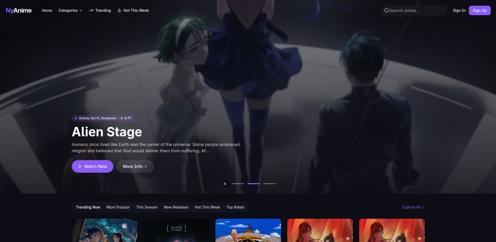

<div align="center">



# ✦ NyAnime

<samp>ネコアニメ — Your Cozy Corner for Anime Streaming</samp>

<br/>

[](https://github.com/AnjishnuSengupta/nyanime/releases)
[](https://nyanime.qzz.io)
[](LICENSE)
[](https://github.com/AnjishnuSengupta/nyanime/stargazers)
[](https://www.instagram.com/anjishnu.prolly)

<br/>

<kbd>[🌐 **Live Demo**](https://nyanime.qzz.io)</kbd>&nbsp;&nbsp;
<kbd>[🖥️ **Terminal Client**](https://github.com/AnjishnuSengupta/ny-cli)</kbd>&nbsp;&nbsp;
<kbd>[🐛 **Report Bug**](https://github.com/AnjishnuSengupta/nyanime/issues)</kbd>

<br/>

</div>

---

<br/>

## 🎯 What's New in v3.0.0

<table>
<tr>
<td>🔔</td>
<td><b>Notifications System</b></td>
<td>Live airing countdowns for every anime in your watch history. The bell icon in the header pulses red when an episode airs within the hour. Full <code>/notifications</code> page with per-anime live timers.</td>
</tr>
<tr>
<td>⌨️</td>
<td><b>Keyboard Shortcuts</b></td>
<td>Full keyboard control in the video player — Space/K (play/pause), arrow keys (seek/volume), F (fullscreen), M (mute), N (next episode), 0–9 (decile jump), and Shift+? for a help dialog. Disabled for iframe embeds.</td>
</tr>
<tr>
<td>📱</td>
<td><b>PWA Support</b></td>
<td>Installable progressive web app with proper app icons, a real service worker (cache-first for assets, network-first for navigation), and a branded install banner. Works offline for cached pages.</td>
</tr>
<tr>
<td>💬</td>
<td><b>Threaded Comment Replies</b></td>
<td>One-level-deep threaded replies on the comment system. Inline reply input, lazy-loaded reply subscriptions, animated expand/collapse. Built on the same Firestore real-time backend.</td>
</tr>
<tr>
<td>🎲</td>
<td><b>Random Anime</b></td>
<td>Shuffle button in the header that picks a random anime from AniList's popular list and navigates you straight to it. Great for discovering new shows.</td>
</tr>
<tr>
<td>✨</td>
<td><b>Page Transitions & Animations</b></td>
<td>CSS-only fade + slide-up route transitions on every page change. Staggered entrance animations on episode grids. All via <code>tailwindcss-animate</code> — zero new dependencies.</td>
</tr>
</table>

<br/>

<details>
<summary><b>Previous Updates (v2.7.0)</b></summary>

<br/>

<table>
<tr>
<td>🧲</td>
<td><b>Hybrid Torrent Streaming</b></td>
<td>Primary stream engine now uses WebTorrent P2P. AnimeTosho is searched server-side for the best-quality, lowest-size release with the most seeders. Falls back to API when no torrent peers are available.</td>
</tr>
<tr>
<td>📺</td>
<td><b>MegaPlay Integration (Server 1)</b></td>
<td>Added MegaPlay as the primary streaming server utilizing robust iframe embedding. This offers an extremely stable streaming alternative when APIs are down or proxies fail.</td>
</tr>
<tr>
<td>🐍</td>
<td><b>Python Scraper Fallback (Server 2)</b></td>
<td>Integrated a robust Python bridge using <code>anipy-cli</code> as a fallback provider (Server 2). Seamlessly streams high-quality, ad-free sources if Torrents and primary APIs fail.</td>
</tr>
<tr>
<td>📊</td>
<td><b>Authoritative Episode Lists</b></td>
<td>Backend-side sequential episode list generation using authoritative metadata from AniList GraphQL and Jikan APIs, fixing missing episodes for ongoing, long-running anime.</td>
</tr>
<tr>
<td>💬</td>
<td><b>Global Firestore Comments</b></td>
<td>A fully functional, real-time comments section powered by Firebase Firestore, categorizing discussions by anime ID across the entire platform.</td>
</tr>
<tr>
<td>📝</td>
<td><b>Native Subtitle Tracks (jimaku.cc)</b></td>
<td>Subtitles are fetched from jimaku.cc using the AniList ID — no ffmpeg dependency. Returns a direct .vtt or .srt URL rendered natively by the browser's <code>&lt;track&gt;</code> element over the torrent stream.</td>
</tr>
<tr>
<td>🛡️</td>
<td><b>Render-Compatible WebTorrent Config</b></td>
<td>Disabled dht/utp/lsd (all UDP, blocked on Render free tier). Reduced maxConns to 20 to prevent OOM crashes. Peer wait timeout tuned to 20s on Render, 10s locally.</td>
</tr>
</table>

</details>

<details>
<summary><b>Previous Updates (v2.5.3)</b></summary>

<br/>

<table>
<tr>
<td>🔍</td>
<td><b>Jikan API Integration</b></td>
<td>Uses Jikan API (official MyAnimeList API, 99.9% uptime) for reliable metadata. Fallback to AnimeKAI for missing data.</td>
</tr>
<tr>
<td>⚡</td>
<td><b>AnimeKAI Streaming Fix</b></td>
<td>Fixed production streaming by using AnimeKAI bridge. Jikan (metadata) → AnimeKAI (streaming sources). Resolves 404 errors on Render.</td>
</tr>
<tr>
<td>📊</td>
<td><b>Accurate Episode Tracking</b></td>
<td>Displays all available episodes correctly. Episode ID format: jikan::malId::episodeNumber for proper routing and fallback.</td>
</tr>
<tr>
<td>🌐</td>
<td><b>Domain Migration</b></td>
<td>Fully migrated to www.nyanime.qzz.io with canonical URL enforcement and PWA support.</td>
</tr>
</table>

</details>

<br/>

---

<br/>

## ✨ Features

<div align="center">

```
╭─────────────────────────────────────────────────────────────────╮
│                                                                 │
│   🎬  STREAMING          👤  EXPERIENCE        🔧  TECHNICAL    │
│   ───────────────        ───────────────       ───────────────  │
│                                                                 │
│   ▸ Torrent P2P          ▸ User Accounts       ▸ React 18 + TS  │
│   ▸ HLS Adaptive         ▸ Watch History       ▸ Vite 7 Build   │
│   ▸ Sub/Dub Toggle       ▸ Favorites List      ▸ Express 5 API  │
│   ▸ Skip Intro/Outro     ▸ Cross-Device        ▸ WebTorrent     │
│   ▸ Native Subtitles     ▸ Custom Avatars      ▸ HLS.js Player  │
│   ▸ Resume Playback      ▸ Dark/Light Mode     ▸ Self-Hosted    │
│   ▸ ⌨️ Keyboard Ctrl     ▸ 📱 PWA Install      ▸ Service Worker │
│   ▸ 🎲 Random Anime      ▸ 🔔 Notifications    ▸ Firestore RT   │
│                                                                 │
╰─────────────────────────────────────────────────────────────────╯
```

</div>

<br/>

<details>
<summary><b>📺 Video Player Highlights</b></summary>

<br/>

| Feature | Description |
|:--------|:------------|
| **🧲 Torrent P2P Streaming** | WebTorrent streams best-quality AnimeTosho releases directly in the browser |
| **🔄 Adaptive Fallback** | Falls back to AnimeKAI API M3U8 sources when no torrent peers are found |
| **📝 jimaku.cc Subtitles** | Subtitle VTT files fetched by AniList ID — no ffmpeg, no side-car downloads |
| **⏭️ Skip Intro/Outro** | Smart buttons appear during intro and outro segments |
| **⏪⏩ Quick Seek** | Instant ±10 second skip buttons for precise playback control |
| **🔁 Auto-Retry** | Multi-phase error recovery: delayed retry → next torrent option → API fallback |
| **📍 Resume Playback** | Continue from exactly where you left off with smart episode progression |
| **🎚️ Source Selector** | Switch between multiple streaming servers on-the-fly |
| **⌨️ Keyboard Shortcuts** | Full keyboard control — play/pause, seek, volume, fullscreen, mute, next episode, decile jumps |

</details>

<details>
<summary><b>👤 User Experience Features</b></summary>

<br/>

| Feature | Description |
|:--------|:------------|
| **🔐 Secure Auth** | Firebase authentication with email/password and Google OAuth |
| **📜 Smart History** | Auto-tracking with intelligent duplicate prevention |
| **🔄 Auto-Progress** | Automatically advance to next episode on 97%+ completion |
| **🗑️ Auto-Cleanup** | Completed series removed automatically from Continue Watching |
| **❤️ Favorites** | Save your favorite anime for instant access |
| **☁️ Cloud Sync** | Seamless sync across all your devices in real-time |
| **🎨 Customization** | Choose from 50+ anime character avatars |
| **🌓 Themes** | Beautiful dark and light mode with smooth transitions |
| **🔔 Notifications** | Live airing countdowns with pulsing bell badge for upcoming episodes |
| **💬 Threaded Comments** | Real-time Firestore comments with one-level-deep replies |
| **📱 PWA Support** | Install as a native app with offline caching and install prompt |
| **🎲 Random Anime** | Discover new anime with a single click from the header |

</details>

<br/>

---

<br/>

## 🖥️ NY-CLI — Watch from Your Terminal

<div align="center">

```
╔══════════════════════════════════════════╗
║                                          ║
║   $ ny-cli search "one piece"            ║
║                                          ║
║   Searching...                           ║
║   Found: One Piece (1120 eps)            ║
║   Playing episode 1120...                ║
║                                          ║
╚══════════════════════════════════════════╝
```

[](https://github.com/AnjishnuSengupta/ny-cli)

</div>

Love the command line? **NY-CLI** brings the full NyAnime experience to your terminal!

```bash
# One-line install
curl -sL https://raw.githubusercontent.com/AnjishnuSengupta/ny-cli/main/install.sh | sh

# Or via npm
npm install -g ny-cli
```

<div align="center">

**Features:** `Search` · `Trending` · `Continue Watching` · `Cloud Sync` · `MPV/VLC Support`

👉 [**Get NY-CLI →**](https://github.com/AnjishnuSengupta/ny-cli)

</div>

<br/>

---

<br/>

## 🚀 Quick Start

<br/>

### Prerequisites

- **Node.js** 18+
- **npm** or **yarn**
- **Firebase** project (for auth & database)

<br/>

### Installation

```bash
# Clone the repository
git clone https://github.com/AnjishnuSengupta/nyanime.git
cd nyanime

# Install dependencies
npm install

# Copy environment template and fill in your values
cp .env.example .env

# Start development server
npm run dev
```

<br/>

### Environment Setup

The minimum required variables are your Firebase credentials:

```env
VITE_FIREBASE_API_KEY=your_api_key
VITE_FIREBASE_AUTH_DOMAIN=your_project.firebaseapp.com
VITE_FIREBASE_PROJECT_ID=your_project_id
VITE_FIREBASE_STORAGE_BUCKET=your_project.appspot.com
VITE_FIREBASE_MESSAGING_SENDER_ID=your_sender_id
VITE_FIREBASE_APP_ID=your_app_id
```

**For subtitles**, add your free [jimaku.cc](https://jimaku.cc) API token:

```env
JIMAKU_API_TOKEN=your_jimaku_token
```

> Get your free token at **jimaku.cc → Account Settings → API**

Open **[localhost:8080](http://localhost:8080)** and start watching! 🎉

<br/>

---

<br/>

## 🛠️ Tech Stack

<br/>

<div align="center">

| Layer | Technologies |
|:-----:|:-------------|
| **Frontend** |     |
| **Backend** |   |
| **Streaming** |   |
| **Services** |   |
| **Sources** |   |

</div>

<br/>

---

<br/>

## 🎬 Streaming Architecture

NyAnime uses a **hybrid torrent-first strategy** for maximum reliability:

### Stream Resolution Order

1. **AnimeTosho Torrent Search** _(Primary — via server-side `/api/torrent-search`)_
   - Searches AnimeTosho for the best release matching the anime title + episode number
   - Scores results by: seeders, quality tag (SubsPlease > Erai-raws > others), and smallest file size at 1080p
   - Returns top 3 deduplicated magnet links as fallback options
   - Streams via WebTorrent directly in the browser with no intermediate download

2. **jimaku.cc Subtitle Fetch** _(Concurrent with torrent search)_
   - Queries jimaku.cc API by AniList ID + episode number
   - Returns a direct `.vtt` or `.srt` URL, served as a native `<track>` element
   - Runs in parallel with the torrent search — zero added latency

3. **MegaPlay (Server 1)** _(Fallback 1 — Iframe embed)_
   - Highly reliable iframe player serving content directly.
   - Used as the primary fallback server if no torrent peers are found.

4. **Anipy-CLI / AnimeKAI API (Server 2)** _(Fallback 2 — Python scraper / Proxy)_
   - Invoked as Server 2 if MegaPlay is undesirable or fails.
   - Fresh CDN tokens fetched at the moment of failure, never pre-fetched or stale
   - M3U8 HLS stream served via same-origin proxy

### Request Flow

```
User clicks episode
       ↓
  ┌────┴────────────────────────────────────┐
  │  Concurrent (Promise.allSettled)        │
  │                                         │
  │  AnimeTosho search → top 3 magnets      │
  │  jimaku.cc search  → subtitle .vtt URL  │
  └────┬────────────────────────────────────┘
       ↓
  WebTorrent streams top magnet in browser
  Native <track> element shows CC subtitles
       ↓ (if 0 peers after timeout / fallback triggered)
  MegaPlay (Server 1) loaded via iframe
       ↓ (if Server 2 selected)
  Lazy-fetch fresh Anipy/AnimeKAI M3U8 token
  HLS.js streams via same-origin proxy
```

### Render Free Tier Compatibility

| Setting | Value | Reason |
|:--------|:------|:-------|
| `dht` | `false` | UDP — blocked on Render free tier |
| `utp` | `false` | UDP — blocked on Render free tier |
| `lsd` | `false` | LAN-only — useless on a server |
| `maxConns` | `20` | Prevents OOM on 512 MB RAM limit |
| Peer wait | `20s` | Render TCP to trackers is ~5–8s slower |

<br/>

---

<br/>

## 📦 Deployment

<br/>

### Render (Recommended)

<table>
<tr>
<td><b>Build Command</b></td>
<td><code>npm install --include=dev && npm run build</code></td>
</tr>
<tr>
<td><b>Start Command</b></td>
<td><code>npm start</code></td>
</tr>
<tr>
<td><b>Health Check</b></td>
<td><code>/health</code></td>
</tr>
</table>

#### Required Environment Variables (Render Dashboard)

| Variable | Required | Description |
|:---------|:--------:|:------------|
| `VITE_FIREBASE_*` (×6) | ✅ | Firebase project credentials |
| `JIMAKU_API_TOKEN` | ⭐ | jimaku.cc subtitle API token (free) |
| `NODE_ENV` | ✅ | Set to `production` |
| `ANIMEKAI_API_URL` | ⚪ | Only if self-hosting AnimeKAI backend |

> **Note:** `ANIMEKAI_API_URL` and `MIRURO_API_URL` no longer need to be set in the Render dashboard.
> `server.js` auto-constructs `https://<service-name>.onrender.com` from `RENDER_EXTERNAL_URL` for free-tier service discovery.

> **Note:** Free tier has ~50s cold start on first request.

### Production Checklist

- ✅ Set `NODE_ENV=production` in Render dashboard
- ✅ Set all 6 `VITE_FIREBASE_*` variables (baked into frontend at build time)
- ✅ Set `JIMAKU_API_TOKEN` for subtitle support
- ✅ Do **not** set `ANIMEKAI_API_URL` or `MIRURO_API_URL` — auto-construction handles it
- ✅ `VITE_API_URL` should be empty (frontend and backend are same service)

<br/>

---

<br/>

## 📁 Project Structure

```
nyanime/
├── 📂 src/
│   ├── 📂 components/
│   │   ├── VideoPlayer.tsx        # HLS + WebTorrent player with keyboard shortcuts
│   │   ├── AnimePlayer.tsx        # Torrent search + jimaku subtitle orchestration
│   │   ├── CommentsSection.tsx    # Threaded comments with replies
│   │   ├── Header.tsx             # Nav bar with bell badge + random anime button
│   │   ├── InstallPrompt.tsx      # PWA install banner
│   │   ├── RandomAnimeButton.tsx  # Shuffle/discover button
│   │   └── ui/                    # shadcn/ui components
│   ├── 📂 pages/
│   │   ├── VideoPage.tsx          # Episode page — passes anilistId to AnimePlayer
│   │   └── Notifications.tsx      # Airing countdown notifications
│   ├── 📂 services/
│   │   ├── aniwatchApiService.ts  # AnimeKAI API fallback client
│   │   ├── commentService.ts      # Firestore comments + replies
│   │   ├── nyaaService.ts         # Magnet URL builder for WebTorrent
│   │   └── streamProxyService.ts  # Same-origin proxy for HLS streams
│   ├── 📂 hooks/
│   │   └── useAiringCountdown.ts  # Per-anime countdown timer hook
│   └── 📂 config/                 # Firebase & API config
├── 📄 server.js                   # Express server — torrent search, subtitle proxy, stream proxy
├── 📄 render.yaml                 # Render deployment config (nyanime + animekai-api services)
├── 📄 trackers.json               # Browser-safe WebTorrent tracker list
├── 📄 firestore.indexes.json      # Firestore composite indexes (comments + replies)
├── 📄 firestore.rules             # Firestore security rules
├── 📄 public/sw.js                # Service worker (cache-first assets, network-first navigation)
├── 📄 public/manifest.json        # PWA manifest with app icons
└── 📄 vite.config.ts              # Vite configuration
```

<br/>

---

<br/>

## 🤝 Contributing

<br/>

Contributions are welcome! Here's how you can help:

```bash
# 1. Fork the repository

# 2. Create your feature branch
git checkout -b feature/amazing-feature

# 3. Commit your changes
git commit -m "feat: add amazing feature"

# 4. Push to the branch
git push origin feature/amazing-feature

# 5. Open a Pull Request
```

<br/>

---

<br/>

## 🔗 Links & Resources

<br/>

<div align="center">

| | |
|:-:|:-:|
| 🌐 **Website** | [nyanime.qzz.io](https://nyanime.qzz.io) |
| 🖥️ **Terminal Client** | [NY-CLI](https://github.com/AnjishnuSengupta/ny-cli) |

</div>

<br/>

---

<br/>

## ⭐ Star History

<br/>

<div align="center">

<a href="https://www.star-history.com/?repos=AnjishnuSengupta%2Fnyanime&type=date&legend=top-left">
 <picture>
   <source media="(prefers-color-scheme: dark)" srcset="https://api.star-history.com/chart?repos=AnjishnuSengupta/nyanime&type=date&theme=dark&legend=top-left" />
   <source media="(prefers-color-scheme: light)" srcset="https://api.star-history.com/chart?repos=AnjishnuSengupta/nyanime&type=date&legend=top-left" />
   
 </picture>
</a>

</div>

<br/>

---

<br/>

## Credits & Thanks

<div align="center">

| | |
|:-:|:-:|
| 🎬 **Streaming API** | [n1yshi/Anime-Streaming-API](https://github.com/n1yshi/Anime-Streaming-API) |
| 🐍 **Python Scraper** | [sdaqo/anipy-cli](https://github.com/sdaqo/anipy-cli) |
| 📝 **Subtitle Source** | [jimaku.cc](https://jimaku.cc) |
| 🧲 **Torrent Index** | [AnimeTosho](https://animetosho.org) |
| 🎞️ **Metadata API** | [Jikan (MyAnimeList API)](https://jikan.moe) |

</div>

<br/>

---

<br/>

## 📜 License

<br/>

<div align="center">

This project is licensed under the **MIT License**.

Use freely. Give credit. Build cool things. 💜

</div>

<br/>

---

<br/>

<div align="center">

### ⚠️ Disclaimer

<samp>
This is an educational project. No video content is hosted on our servers.<br/>
All streams are sourced from public torrent trackers and third-party providers. Use responsibly.
</samp>

<br/>
<br/>

---

<br/>


<br/>

<samp>

*"In a world full of filler episodes, be the main arc."* ✦

</samp>

<br/>

**Made with 💜 by [Anjishnu](https://github.com/AnjishnuSengupta)**

[](https://www.instagram.com/anjishnu.prolly)

<br/>

⭐ Star this repo if you found it useful!

</div>
